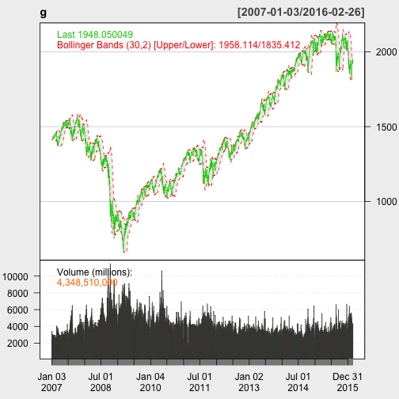
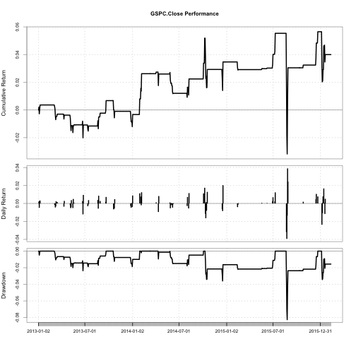

## What's it for?

* The app is a workshop for [stock backtesting](http://www.investopedia.com/terms/b/backtesting.asp) 
using [Bollinger Bands](http://stockcharts.com/school/doku.php?id=chart_school:technical_indicators:bollinger_bands) assuming no commisssion. (Data from Yahoo)

* Backtesting is basically testing your set of rules ('strategy') against historical data and see how
profitable it is.

* You can access the app [here](https://cstorm125.shinyapps.io/bollinger/)

* Warning: You may have to wait for plots to load/reload.

--- &twocol

## What is Bollinger Bands strategy?

*** {name: left}

* Bollinger Bands is a strategy where one buys when price drops below the lower band and sells when it pops over the upper band.

* The upper and lower bands (red) are moving averages of type SMA (simple), WMA (weighted), or EMA (exponential) for a given days plus/minus two standard deviations.

*** {name: right}

---

## What to input?

One can customize the parameters of the Bollinger bands by the sidebar input:

* Symbol: symbol of the stock you want to backtest

* Date Range: range of date for beginning and ending the backtest

* Method: method for calculating the lower and upper bands: SMA (simple), WMA (weighted), EMA (exponential)

* Moving Average Days: number of days used to calculate the moving averages

Varying these parameters gives different results and analysis.

--- &twocol

## What to make of the result?

*** {name: left}

* Cumulative return is the total return since one begins trading. For example, a cumulative return of 0.10 means 10% total return.

* Daily return is return on a daily basis.

* Drawdowns are periods where the portfolio is at loss. For instance, -0.1 drawdown means one is losing 10%.

*** {name: right}

